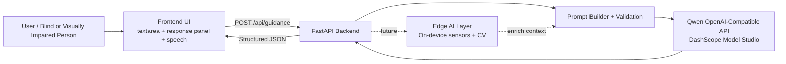

# SightlineAI Architecture

SightlineAI is a local-first hackathon MVP that combines a lightweight frontend with a FastAPI backend and Qwen Cloud integration for accessibility-focused environmental guidance.

## Mermaid Diagram

## Accessibility Workflow

1. User enters a natural-language scene description.
2. Backend validates input and builds a safety-aware accessibility prompt.
3. Qwen returns structured guidance (`guidance_text`, `safety_notes`, `confidence_notes`).
4. Frontend displays concise guidance and optionally reads it aloud with browser speech synthesis.
5. Future edge layer can supply live context from sensors/camera to improve real-time guidance.
