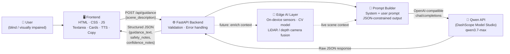

# SightlineAI Architecture

SightlineAI is a local-first accessibility AI prototype that pairs a lightweight, accessible frontend with a FastAPI backend and Qwen Cloud for safety-focused environmental guidance.

---

## System Diagram



---

## Component Responsibilities

| Component | Role |
|---|---|
| `frontend/index.html` | Accessible single-page UI; ARIA live regions, skip link, keyboard shortcut |
| `frontend/app.js` | Fetch API call, speech synthesis, clipboard copy, example chips, char counter |
| `frontend/style.css` | Dark-theme design system; responsive, reduced-motion aware |
| `app/main.py` | FastAPI application; routes, CORS, structured exception handlers |
| `app/config.py` | Immutable settings dataclass loaded from environment variables |
| `app/schemas.py` | Pydantic request/response validation models |
| `app/prompts.py` | System prompt (JSON-constrained output) + user prompt builder |
| `app/qwen_client.py` | HTTP client with timeout, network, and HTTP error classification |
| `app/utils.py` | JSON extraction from model output; response normalisation with safe fallbacks |

---

## Accessibility Workflow

1. **User** types a plain-language scene description (or selects an example prompt).
2. **Frontend** validates the input client-side (non-empty, within 2000 chars) and `POST`s to `/api/guidance`.
3. **Backend** validates the payload with Pydantic, then passes it to `QwenClient`.
4. **Prompt Builder** wraps the scene in a JSON-constrained system + user prompt that instructs Qwen to return exactly three fields.
5. **Qwen API** returns a structured JSON object over the DashScope OpenAI-compatible endpoint.
6. **Response Parser** (`utils.py`) extracts the JSON object from the raw completion text, normalises missing fields with safe accessibility fallbacks, and returns a `GuidanceResponse`.
7. **Frontend** renders three styled output cards (Guidance · Safety Notes · Confidence Notes) and enables TTS and clipboard copy.

---

## Error Handling Chain

```
MissingAPIKeyError  →  503 configuration_error   (operator must set DASHSCOPE_API_KEY)
UpstreamAPIError    →  502 upstream_api_error     (Qwen timeout, network failure, HTTP 4xx/5xx)
QwenClientError     →  500 qwen_client_error      (JSON parse / normalisation failure)
RequestValidationError → 400 invalid_input        (Pydantic field validation)
```

Frontend always displays a graceful fallback card with safe-default accessibility guidance when any error occurs.

---

## Future: Edge AI Layer

The dashed path in the diagram represents a planned edge AI extension:

- **On-device sensors** (LiDAR, depth camera, microphone) capture real-time environmental data.
- A lightweight **CV model** runs locally to detect obstacles, classify surfaces, and estimate distances.
- The edge layer enriches the prompt with live spatial context, improving Qwen's guidance quality without requiring full scene verbalization from the user.
- This architecture keeps latency low and works in low-connectivity environments.

---

## Scalability Notes

- The backend is stateless — each request is independent, making horizontal scaling trivial.
- The Qwen client uses synchronous `requests` for simplicity; replacing it with `httpx` + FastAPI async routes would support higher concurrency with no architectural change.
- Static frontend assets are served by FastAPI `StaticFiles`; a CDN can take this over with a single path change.
- Environment-variable configuration means deployment to any platform (Docker, Railway, Render, Fly.io) requires no code changes.

