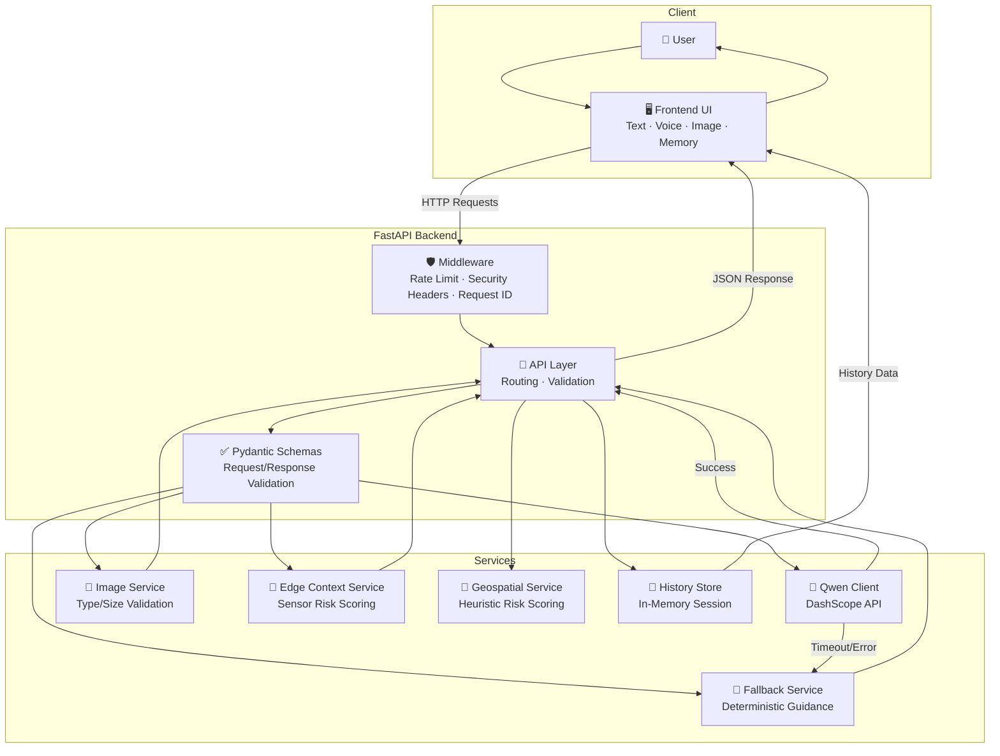

# SightlineAI Architecture

> System design, data flows, component descriptions, and technology decisions.

---

## System Architecture Diagram



---

## Component Descriptions

### Frontend (`/frontend`)

Vanilla HTML/CSS/JS application with zero external dependencies. Provides:

- **Scene input form** — text area for scene descriptions with optional geospatial fields
- **Image upload** — drag-and-drop or file picker with client-side preview
- **Voice controls** — Web Speech API integration for recognition (input) and synthesis (output)
- **Memory panel** — localStorage-backed session history with pin/restore/clear actions
- **Accessibility states** — ARIA labels, keyboard navigation, focus management, high-contrast theme

### FastAPI Backend (`app/main.py`)

Central application orchestrator responsible for:

- Route registration and request routing
- CORS configuration (strict in production, open in development)
- Middleware pipeline: rate limiting → request sizing → security headers → request ID injection
- Error handling with consistent JSON error schema
- Static file serving for the frontend with path-traversal protection

### Pydantic Schemas (`app/schemas.py`)

Strictly typed request/response models providing:

- Input validation (length constraints, type checking, field requirements)
- Automatic OpenAPI schema generation
- Response serialization with guaranteed structure

### Qwen Client (`app/qwen_client.py`)

OpenAI-compatible API client for Qwen models via DashScope:

- Sends structured prompts requesting strict JSON output
- Handles timeout management (`QWEN_TIMEOUT_SECONDS`)
- Classifies errors: `MissingAPIKeyError`, `UpstreamAPIError`, `QwenClientError`
- Returns parsed `GuidanceResponse` on success

### Fallback Guidance Service (`app/services/fallback_guidance.py`)

Deterministic safety-first guidance engine:

- Generates structured guidance without any external API call
- Produces `guidance_text`, `safety_notes`, and `confidence_notes`
- Explicitly labels output as `mode: "fallback"` with a `fallback_reason`
- Used automatically when Qwen is unavailable or manually via `/api/fallback-guidance`

### Image Analysis Service (`app/services/image_analysis.py`)

Safe image processing pipeline:

- Validates MIME type against allowed formats (JPEG, PNG, WEBP)
- Checks file header signatures to prevent MIME spoofing
- Enforces configurable size limits (`MAX_IMAGE_BYTES`, default 5 MB)
- Returns `ImageAnalysisResponse` with summary and structured guidance

### Edge Context Service (`app/services/edge_context.py`)

Sensor-fusion risk abstraction layer:

- Accepts structured sensor data (obstacle distance, noise level, motion state, GPS accuracy, battery)
- Computes aggregate risk score (0–100) with risk band classification
- Returns actionable suggested actions
- Ready for future hardware adapter integration (depth sensors, lidar, IMU, haptics)

### Geospatial Service (`app/services/geospatial.py`)

Heuristic risk scoring for location context:

- Evaluates `known_hazards`, `time_of_day`, `mobility_aid`, and location metadata
- Returns a risk score (0–100) that biases toward conservative (higher risk) values
- Explicitly documented as non-navigation-grade — a safety aid, not a certified system

### History Store (`app/services/history_store.py`)

In-memory session history manager:

- Stores `SessionHistoryItem` entries with source, scene description, and full guidance response
- Supports listing, creating, and clearing entries
- Resets on backend restart (future: persistent database)

---

## Data Flow Descriptions

### 1. Text Guidance Workflow

```
User types scene description
  → Frontend sends POST /api/guidance
  → Middleware: rate check → request ID → security headers
  → Pydantic validates GuidanceRequest
  → Qwen Client attempts AI guidance
    → Success: returns GuidanceResponse(mode="qwen")
    → Failure: Fallback Service returns GuidanceResponse(mode="fallback")
  → Geospatial Service computes risk_score
  → History Store records the exchange
  → Response returned to frontend
  → Optional: Speech synthesis reads guidance aloud
```

### 2. Image Analysis Workflow

```
User uploads image (PNG/JPEG/WEBP)
  → Frontend sends POST /api/analyze-image (multipart/form-data)
  → Image Service validates:
    → MIME type check against allowed formats
    → Header signature verification (prevents spoofing)
    → File size enforcement (≤ MAX_IMAGE_BYTES)
  → Structured ImageAnalysisResponse generated
  → History Store records the exchange
  → Response with image_summary + guidance returned
```

### 3. Edge Context Workflow

```
Sensor/hardware sends sensor data
  → POST /api/edge-context with obstacle distance, noise, motion, GPS, battery
  → Edge Context Service computes risk score and band
  → Generates context-aware suggested_actions
  → EdgeContextResponse returned
```

### 4. Voice Workflow

```
User activates voice input (browser-dependent)
  → Web Speech API captures transcript
  → Transcript fills scene_description field
  → Standard guidance workflow executes
  → Response displayed + optionally read aloud via Speech Synthesis
```

### 5. Memory/History Workflow

```
Every guidance/image response → auto-saved to:
  → Backend: in-memory History Store (server-side)
  → Frontend: localStorage memory panel (client-side)
User can: pin important entries, restore previous guidance, clear history
API: GET / POST / DELETE /api/session-history for programmatic access
```

---

## Technology Decisions Rationale

| Decision | Rationale |
|---|---|
| **FastAPI** over Flask/Django | Async support, automatic OpenAPI docs, Pydantic integration, high performance |
| **Pydantic v2** for schemas | Strict validation, automatic serialization, clear error messages for API consumers |
| **Vanilla HTML/CSS/JS** frontend | Zero dependencies = maximum portability, fast loading, no build step needed |
| **Qwen via DashScope** | OpenAI-compatible API, strong multilingual support, accessible pricing |
| **Deterministic fallback** | Guarantees functionality without network — critical for accessibility tool |
| **In-memory history** | Simple, fast, zero-config. Persistent DB is a roadmap item |
| **No authentication** | Local-first tool; no user accounts needed for the current scope |
| **MIME + signature validation** | Defense-in-depth against malicious file uploads |

---

## Security Architecture

### Middleware Pipeline

Every request passes through the security middleware:

1. **Request ID** — `X-Request-ID` header for tracing (auto-generated if missing)
2. **Rate Limiting** — 60 requests/minute per IP, in-memory tracker
3. **Request Size Limit** — 10 MB max for non-upload endpoints
4. **Secure Response Headers:**
   - `X-Content-Type-Options: nosniff`
   - `X-Frame-Options: DENY`
   - `Referrer-Policy: strict-origin-when-cross-origin`
   - `Content-Security-Policy: default-src 'self'; ...`

### Input Validation

- All request bodies validated through Pydantic models with strict constraints
- Image uploads: MIME type allowlist + header signature verification + size bounds
- String fields have `max_length` constraints to prevent resource exhaustion

### Error Hygiene

- JSON error schema avoids stack traces or internal details
- `request_id` attached to every error for debugging without information leakage
- Validation errors include field-level details but no system internals

### Secrets Management

- API keys loaded exclusively from environment variables
- `.env` file excluded via `.gitignore`
- Config validation warns on suspicious values (high timeouts, non-HTTPS URLs)

---

## Scalability Considerations

| Area | Current | Future |
|---|---|---|
| **History Store** | In-memory dict | PostgreSQL / SQLite for persistence |
| **Rate Limiting** | In-memory per-process | Redis-backed distributed limiting |
| **Session State** | Single-process | External session store for multi-worker |
| **Image Processing** | Synchronous validation | Async queue for heavy processing + OCR |
| **Deployment** | Single Uvicorn worker | Gunicorn + multiple workers behind reverse proxy |
| **Caching** | None | Response caching for repeated scene descriptions |
| **Monitoring** | Structured logs | Prometheus metrics + health dashboards |
