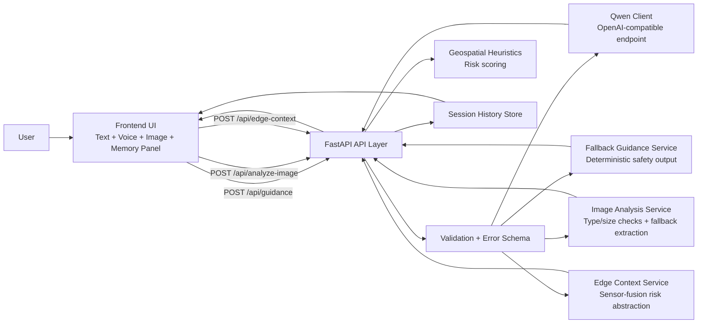

# SightlineAI Architecture

## Frontend flow
- Collects scene text, optional geospatial context, image uploads, and voice transcript.
- Sends requests to dedicated APIs.
- Displays structured cards, speaks guidance, and stores local history.

## Backend flow
- Validates each request through Pydantic schemas.
- Attempts Qwen guidance first for `/api/guidance`.
- Falls back deterministically on missing key, timeout, or parse/upstream errors.
- Returns typed responses with risk score and mode labels.

## Qwen path
- Prompt template in `app/prompts.py` enforces strict JSON output format.
- `app/qwen_client.py` applies timeout + upstream error classification.

## Fallback path
- `app/services/fallback_guidance.py` generates deterministic safety-first output.
- Used by `/api/fallback-guidance` and auto-degradation in `/api/guidance`.

## Image path
- `/api/analyze-image` validates bytes and supported formats.
- Returns structured accessibility guidance even without multimodal cloud parsing.

## Voice path
- Browser speech recognition writes transcript into scene input when supported.
- Speech synthesis reads structured response content.

## Memory path
- Backend in-memory session history APIs.
- Frontend localStorage memory panel with pin/restore/clear actions.

## Geospatial context
- Optional route/location/hazard context influences risk scoring.
- Conservative heuristic scoring only; not a certified navigation engine.

## Edge AI future layer
- `/api/edge-context` models sensor-fusion style risk aggregation.
- Designed for future hardware adapters (depth, lidar, IMU, haptics).
